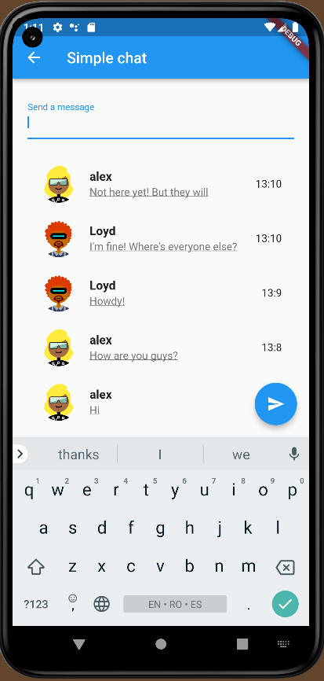
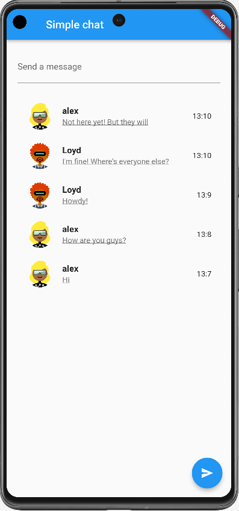
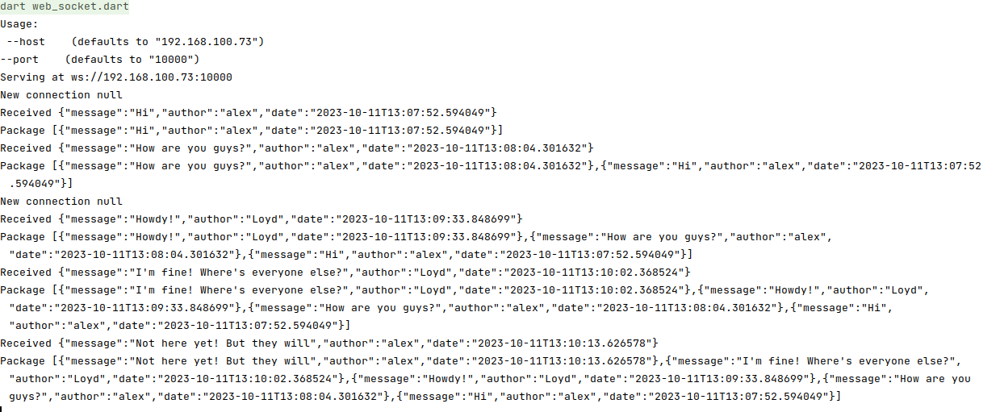

# Pure Flutter/Dart Fullstack Chat with Websocket

## 1. Intro
This is a very simple Chat application written completely in Flutter/Dart. I created it to see if it is possible to have a Dart/Flutter Websocket chat solution.

It has 2 sub-projects:
* Back-end  - written completelly in Dart [flutter-fullstack-chat-websocket-server](https://github.com/alexgheorghiu/flutter-fullstack-chat-websocket-server)
* Front-end written in Flutter [flutter-fullstack-chat-websocket-app](https://github.com/alexgheorghiu/flutter-fullstack-chat-websocket-app)

### 1.1 How it looks like

**Client**

.
.

**Server**

.

## 2. How to make it work

### 2.1 Launch the server

```bash
#download repo
git clone git@github.com:alexgheorghiu/flutter-fullstack-chat-websocket-server.git

#go into folder
cd flutter-fullstack-chat-websocket-server

#launch server
dart run
```

### 2.2 Launch application

```bash
#download repo
git clone git@github.com:alexgheorghiu/flutter-fullstack-chat-websocket-app.git

#go into folder
cd  flutter-fullstack-chat-websocket-app

#see available devices
flutter devices

#launch app
flutter run -d {your_device}
```